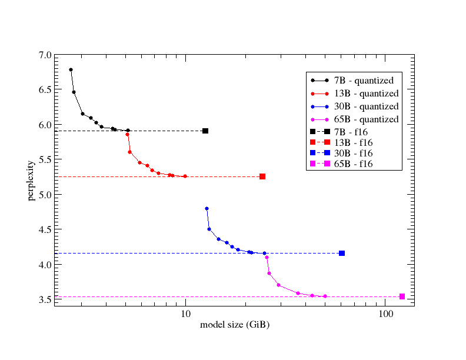
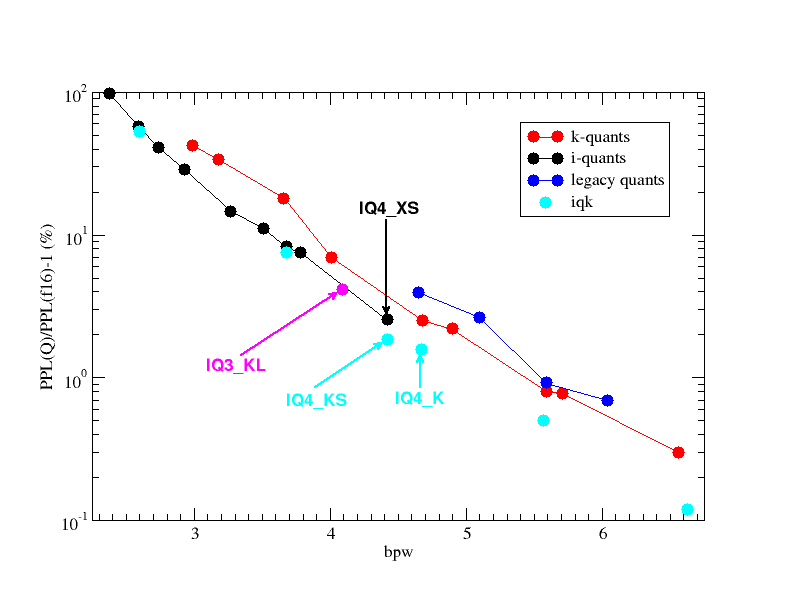
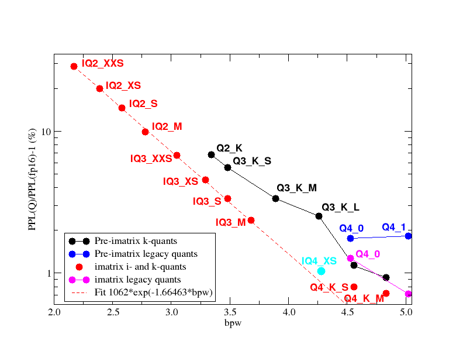

# GGUF Quantization

## Overview

GGUF Quantization formats are the QK_0/QK_1 (legacy quants), QK_K (k-quants) and IQ_S (i-quants) quantizations used by the `ggml` library and `llama.cpp`. They all use block-wise quantization rather than row-wise quantization, so they can only be used with models that have layers or rows that are a multiple of the block size of 256 weights. Though they initially only supported Post-Training Quantization, they now all support Quantization-Aware Training to reduce quality loss.

### QK_0, QK_1 (legacy quants)

These formats are no longer state-of-the-art, but are still available.

The `_0` suffix indicates that the quantization only has a block scale, but not a block minimum. The `_1` suffix indicates that it also includes block minimums or offsets.

They all use Round-To-Nearest quantization, and have a block size of 32 weights. [llama.cpp/wiki/Tensor-Encoding-Schemes](https://github.com/ggerganov/llama.cpp/wiki/Tensor-Encoding-Schemes)

Quantization types are [Q4_0](./Q4_0.md), [Q4_1](./Q4_1.md), Q5_0, Q5_1, Q8_0, and Q8_1.

### QK_K (k-quants)

These models superceded the QK_0 and QK_1 legacy quants. Perplexity loss is lower for a similar bits-per-weight ratio.

The k-quants support both static quantization (without calibration data), and importance matrix quantization (with calibration data). [llama.cpp#4930](https://github.com/ggerganov/llama.cpp/pull/4930)

They all use k-quantization rather than Round-To-Nearest quantization, and have a super-block size of 256 weights, though some use 8 super-blocks of 32 blocks, and others use 16 super-blocks of 16 blocks. [llama.cpp/wiki/Tensor-Encoding-Schemes](https://github.com/ggerganov/llama.cpp/wiki/Tensor-Encoding-Schemes)

From [ikawrakow](https://github.com/ggerganov/llama.cpp/pull/1684), the image below graphs perplexity and model size for many QK_K quantization types.

Quantization types are [Q2_K](./Q2_K.md), Q3_K, [Q4_K](./Q4_K.md), Q5_K, [Q6_K](./Q6_K.md), and Q8_K.

### IQ_S (i-quants)

These have the best bits-per-weight to perplexity loss ratio for low-bit quants.

Perplexity loss is lower for i-quants than for k-quants at the same bits-per-weight ratio. [ik_llama.cpp#83](https://github.com/ikawrakow/ik_llama.cpp/pull/83)

They all use i-quantization rather than Round-To-Nearest quantization, and have a super-block size of 256 weights, though some use 8 super-blocks of 32 blocks, and others use 16 super-blocks of 16 blocks. [llama.cpp/wiki/Tensor-Encoding-Schemes](https://github.com/ggerganov/llama.cpp/wiki/Tensor-Encoding-Schemes)

From [ikawrakow](https://github.com/ikawrakow/ik_llama.cpp/pull/83), this graph shows how well these three quantization formats maintain perplexity for a given bits-per-weight ratio. A value being lower on this graph indicates lower perplexity loss. A value being further to the right indicates that it uses more bits to store each weight.

Quantization types are IQ1_S, IQ1_M, IQ2_XXS, IQ2_XS, IQ2_S, IQ3_XXS, IQ3_S, IQ4_NL, and IQ4_XS.

### Importance Matrix Generation

An [importance matrix](https://github.com/ggerganov/llama.cpp/blob/master/examples/imatrix/README.md) can be generated using a text data set and a non-quantized model. It is used during quantization to set scales and offsets at levels that minimize perplexity loss.

From ikawrakow, the following image shows perplexity loss graphed against bits-per-words for the legacy quants, k-quants, and i-quants, which all perform better with an imatrix: [llama.cpp#5747](https://github.com/ggerganov/llama.cpp/pull/5747)

