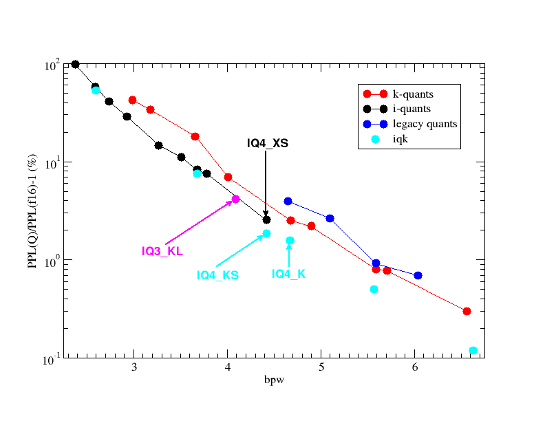

# GGUF IQ4_XS Quantization

## Overview

IQ4_XS is a non‑linear quantization scheme that compresses weights to approximately 4.25 bits.
Although the scheme is prefixed with “I,” it does not use an importance matrix. Instead, it computes per‑block scale factors using the squared values of the weight row. Rather than rounding weights to the nearest representable integer in 4 bits like the legacy quants, or k-quant rounding, weights are rounded to the nearest value of a fixed table called `kvalues_iq4nl`.

It offers better compression than Q4_K, with similar or slightly less loss.

A fixed lookup table is used to map 4‑bit indices to the quantized values.

## Before Quantization: Floating-Point Weights (BF16)

The layer consists of 2048 floating‑point weights in BF16 (BFloat16) format:

For example, an array of floating‑point weights for a layer before quantization might be:

    [1.25, -0.5, 2.3, -1.1, ..., 1.0, -0.9]  <- 2048 weights in total

- Each BF16 weight occupies 16 bits (2 bytes).
- Total size before quantization: 2048 × 2 = 4096 bytes.

## After Quantization: IQ4_XS Format

Non-Linear Quantization:

* The algorithm uses an iterative search based on the squared values of the input row (with a baseline computed from the sum of squares) to determine optimal block scale factors.

Lookup Table Usage:

* Instead of direct bit extraction (as in Q4_0), each 4‑bit value is used to index a fixed lookup table:
   * For a byte q, the low nibble is processed as:

       * `value_low = lookup_table[q & 0xf]`
   * The high nibble is processed as:

       * `value_high = lookup_table[q >> 4]`
   * The cost of these lookups is [negligible](https://github.com/ggerganov/llama.cpp/pull/5747#issuecomment-1966437513) on both GPUs and CPUs.

The quantized weight is reconstructed via:

    `w = kvalue * (d * (ls - 32))`

where:
- `d` is the global scale (stored as a 16‑bit FP16) common to the super‑block.
- `ls` is the combined local scale for each block (reconstructed from packed 6‑bit values) such that (ls - 32) centers the scale around zero.
- `kvalue` is determined from a predefined lookup table (`kvalues_iq4nl`), based on the 4‑bit quantized value stored for each weight.

The kvalues:

    kvalues_iq4nl: [-127, -104, -83, -65, -49, -35, -22, -10, 1, 13, 25, 38, 53, 69, 89, 113]

### Step 1: Divide into Super‑Blocks and Blocks

- **Super‑Blocks:**  
  The 2048 weights are divided into 8 super‑blocks, each containing 256 weights.

- **Blocks:**  
  Each super‑block is further subdivided into 8 blocks of 32 weights each.

### Step 2: Compute Global and Local Scales with Importance Adjustment

For each super‑block:
 * Baseline Calculation:
   * `Baseline = (2 / (number of super-block weights)) × (sum of squares of super-block weights)`
For each 32‑weight block:
 * If external quantization weights are provided:
   * Each weight is processed as:
      * `modified_weight[j] = external_weight[j] * sqrt(baseline + (weight[j])²)`
   * This enables already-quantized weights to be re-quantized, adapting the already-quantized weights to the distribution of the original weights.
 * Otherwise:
   * Simply square each weight:
      * `modified_weight[j] = (weight[j])²`
 * Determine Block Extremes:
   * Find the maximum absolute value and its corresponding signed value.
 * Iterative Scale Search for Block Scales:
   * An initial candidate scale is derived from the maximum absolute value in the block.
   * An iterative search over the range [-7, 7] refines the scale to optimize the ratio between weighted sums.
     * For each trial, calculate a candidate scale
       * `sum A = sum of: for all block weights (x[j] * q[j] * w[j])`
         * x: the original weight value in the block
         * q: the quantized weight value of x, obtained from the lookup table
         * w: the modified_weight factor
       * `sum B = sum of: for all block weights (q[j]² * w[j])`
       * Compute the candidate scale: `d = (sum A) / (sum B)`
     * The scale is compared like this:
       * For all integers in ntry [-7, 7], calculate `id = (ntry -127) / max`, where `max` is the maximum value of any weight in the block.
       * From this new scale `id`, use this new scale to quantize the weights `q`, and check `d = (sum A) / (sum B)` again with this new scale, eventually choosing the block scale that gives the smallest quantization error.
 * Store Block Scale:
   * Save the final per‑block scale for later use.
 * Global Scale Determination:
   * Across the blocks in the super‑block, the maximum block scale is tracked.
   * If there is more than one block, a global scale for the super‑block is set based on the maximum block scale (divided by 32 and negated).
   * This means the global scale is determined solely by the maximum block scale.
 * Packing Local Scales:
   * Each block’s local scale (after being clamped to a range from –32 to 31 and offset by 32) is packed into 6 bits:
      * Lower 4 bits: Packed from multiple blocks.
      * Upper 2 bits: Stored in a separate byte.

### Step 3: Quantize Each Weight to 4 Bits

 * Mapping to 4‑Bit Index:
   * For each weight in the block, compute a 4‑bit index (range 0–15) using the computed scale.
   * Select the index of `kvalues_iq4nl` that best approximates the scaled value.

 * Packing Quantized Values:
   * Two 4‑bit indices are stored per byte.
   * Each super‑block (256 weights) produces 128 bytes of quantized weight data.

### Step 4: Dequantization Process

At inference time, the dequantization follows these steps:
1. **Extract Global and Local Scales:**  
   Retrieve the FP16 global scale `d` and reconstruct the local scale `ls` by combining `scales_l` and `scales_h`. Subtract 32 to center the value:
    * For each 4‑bit quantized index, perform the lookup:
    * Use `lookup_table[q & 0xf]` for the lower 4 bits.
    * Use `lookup_table[q >> 4]` for the higher 2 bits.
    * Reconstruct the local scale: `scale = ((scale_h << 4) | scale_l) - 32`

     `ls = (extracted 6‑bit value) − 32`

2. **Compute Block‑Specific Scaling Factor:**  
   Multiply `d` by the adjusted local scale to obtain:
   
     `dl = d * (ls − 32)`

3. **Recover the Weight:**  
   The quantized 4‑bit value is used to select a correction factor (`kvalue`) from the lookup table `kvalues_iq4nl`. The final dequantized weight is then given by:
   
     `w = dl * kvalue`

## Final Memory Layout

For each super‑block (256 weights):

| Section                              | Data Format                                          | Size per Super‑Block |
|--------------------------------------|------------------------------------------------------|----------------------|
| **Global Scale (d)**                 | FP16                                                 | 2 bytes              |
| **Block Scales (scales_l + scales_h)** | Packed 6‑bit values (8 blocks per super‑block)         | 6 bytes              |
| **Quantized Weights (qs)**           | Packed 4‑bit values                                  | 128 bytes            |
| **Total per Super‑Block**            |                                                      | **136 bytes**        |

## Comparison: Before and After Quantization

| Data                                   | Format             | Total Size in Bytes |
|----------------------------------------|--------------------|---------------------|
| Original Floating‑Point Weights        | BF16 (16 bits)     | 4096 bytes          |
| Quantized Weights (IQ4_XS)             | IQ4_XS (4.25 bits) | 1088 bytes          |

## Limitations

IQ4_XS quantization requires that the total number of weights be divisible by 256 (the super‑block size). Layers with a non‑divisible count must be padded or trimmed.

